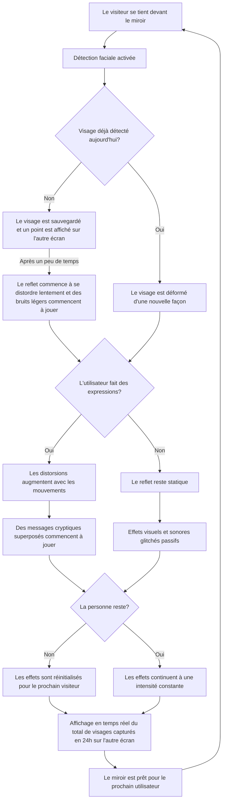
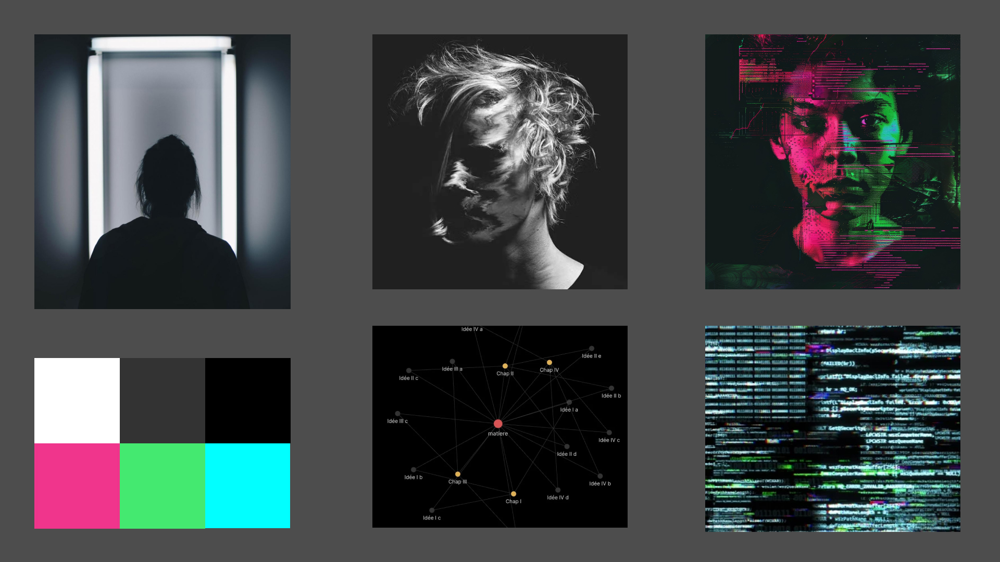

# Doppelgänger

## Idée
 "Doppelgänger" est une installation interactive qui a la forme d'un miroir qui déforme le reflet de l'utilisateur, projettant des distortions sonores et visuelles, symbolisant l’exploitation de la vie privée par des groupes qui cherchent à abuser nos données personnelles.
  
  
 Une caméra placée hors de vue capture le visage de l'utilisateur pour lui appliquer des filtres à chaque différente visite; son reflet sera déformé pour simuler les conséquences de l'utilisation non consentie de nos informations personnelles. Des indices visuels et sonores apparaissent, suggérant que les traits de l’utilisateur sont "analysés" par une intelligence artificielle. Pour chaque visage unique détecté dans un cycle de 24 heures, un point apparaîtra sur un diagramme affiché sur un autre écran, illustrant le nombre de personnes capturées. Le but de l'installation est d'inviter les utilisateurs à une réflexion sur la collecte des données personnelles auxquelles on ne voudrait pas divulguer, en provoquant un sentiment d'inconfort qui poussera le monde à rester vigilant ainsi que de lutter contre les organismes qui abusent de notre droit à la vie privée.

## Scénario

## Scénario

